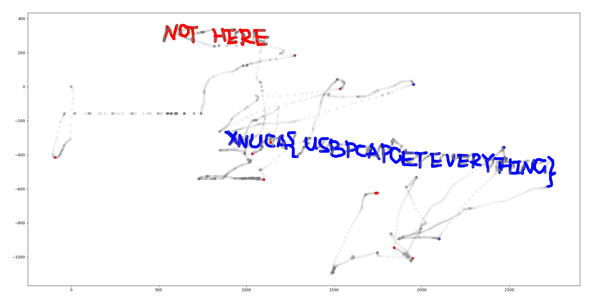

## Description

A forensic script that can help you to extract mouse movement / click data from usb traffic files.

## Installation

### Clone this repository

```bash
git clone https://github.com/WangYihang/USB-Mouse-Pcap-Visualizer.git
```

### Install Python dependencies

```bash
cd USB-Mouse-Pcap-Visualizer
pip install poetry
poetry install
```

### Install tshark

> Winodws

Install WireShark and add `tshark` to your `PATH`.

> Linux (Ubuntu)

```bash
sudo apt install tshark
```

## Usage

```bash
poetry run python usb-mouse-pcap-visualizer.py --help
usage: usb-mouse-pcap-visualizer.py [-h] [-i INPUT_FILE]

options:
  -h, --help            show this help message and exit
  -i INPUT_FILE, --input-file INPUT_FILE
                        Path to the input pcap file.
```

```bash
poetry run python usb-mouse-pcap-visualizer.py -i example/example.pcap
```

> The left button will be rendered as red, the right button will be rendered as blue, and mouse movement will be rendered as grey.



## Demonstration Videos

* https://www.youtube.com/watch?v=unBwmcpXbhE
