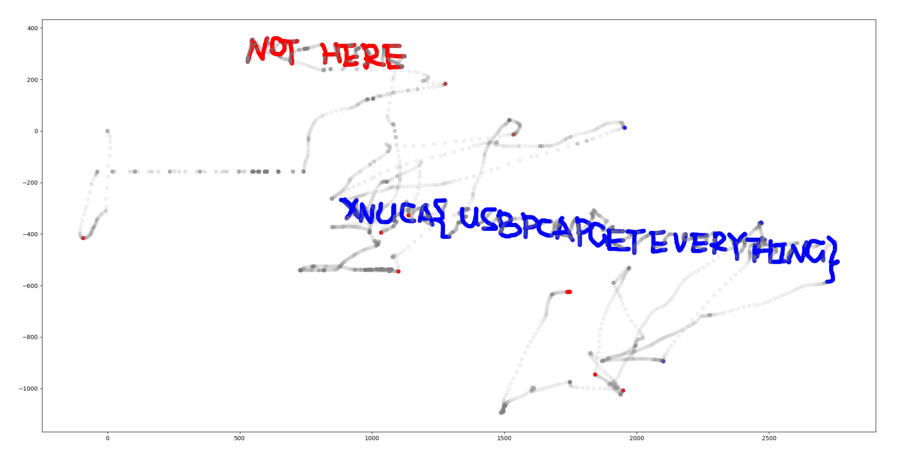

## Description

A forensic script that can help you to extract mouse movement / click data from usb traffic files.


## Installation

### Clone this repository

```bash
git clone https://github.com/WangYihang/USB-Mouse-Pcap-Visualizer.git
```

### Install Python dependencies

```bash
cd USB-Mouse-Pcap-Visualizer
pip install poetry
poetry install
```

### Install tshark

> Winodws

Install WireShark and add `tshark` to your `PATH`.

> Linux (Ubuntu)

```bash
sudo apt install tshark
```

## Usage

```bash
$ poetry run python usb-mouse-pcap-visualizer.py --help
usage: usb-mouse-pcap-visualizer.py [-h] -i INPUT_FILE -o OUTPUT_FILE

options:
  -h, --help            show this help message and exit
  -i INPUT_FILE, --input-file INPUT_FILE
                        Path to the input pcap file.
  -o OUTPUT_FILE, --output-file OUTPUT_FILE
                        Path to the output csv file.
```

```bash
poetry run python usb-mouse-pcap-visualizer.py -i assets/example/XNUCA/data.pcap -o assets/example/XNUCA/data.csv
```

The csv file can be visualized by `assets/index.html`, or try it [online](https://usb-mouse-pcap-visualizer.vercel.app/).

```csv
timestamp,x,y,left_button_holding,right_button_holding
1478943238.284336,0,0,False,False
1478943238.899621,0,0,False,False
1478943238.899621,0,0,False,False
```




## Demonstration Videos

* https://www.youtube.com/watch?v=unBwmcpXbhE
